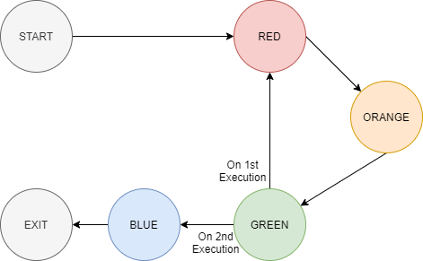
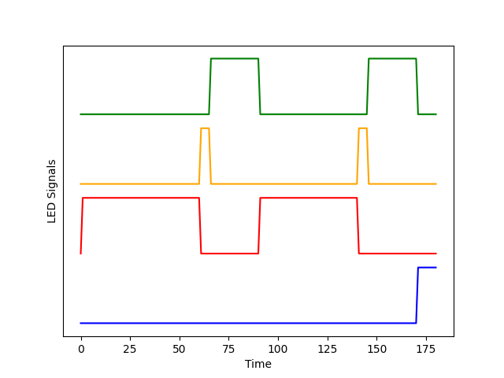
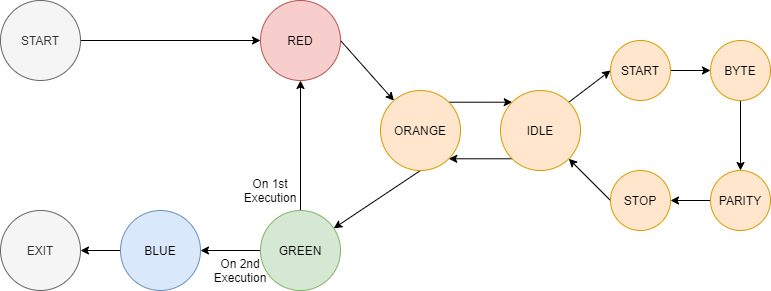
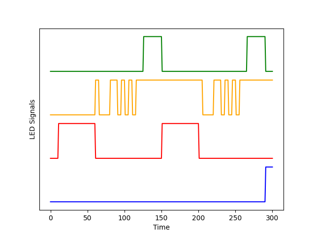

# Lab 5 FSM
FSM (Finite State Machines) are a popular way of orchestrating code execution, through the use of a FSM you can reason the code paths that will be taken based on given events. In this lab we assume that we have most of the drivers and functionality of our device implemented and we need to implement an orchestrator that will ensure that things work in the expected order.

## Part 1 - Implement the Main FSM (40%)
Implement the state machine in `part_1.c` as described in the given image

* In Red State, turn the LED on for 10 milliseconds
* In Orange State, turn the Orange LED on for 1 millisecond
* In Green State, turn the Green LED on for 5 milliseconds
* In Blue State, turn the Blue LED on for 2 milliseconds

The output of the implemented state machine should look like this

## Part 2 - Implement UART Sub FSM (30%)
Replace the Orange State to send data over UART TX by implementing the UART Sub State Machine. The UART Output should have Idle, Start Bit, Stop Bit, Parity Bit (Even Parity) and the actual Byte, you can follow this FSM Diagram for implementation. You should have a 1 millisecond delay after each bit is transmitted so that it can show up on the output.

You need to send `0xAC` over UART and the output should look like this figure

## Part 3 - Add Encoding to UART (30%)
Update the UART State Machine to transmit data using Manchester encoding, as such each `1` should be transmitted as `01` and `0` should be transmitted as `10`. The output should look like this figure

Explain the problem with IDLE output here.