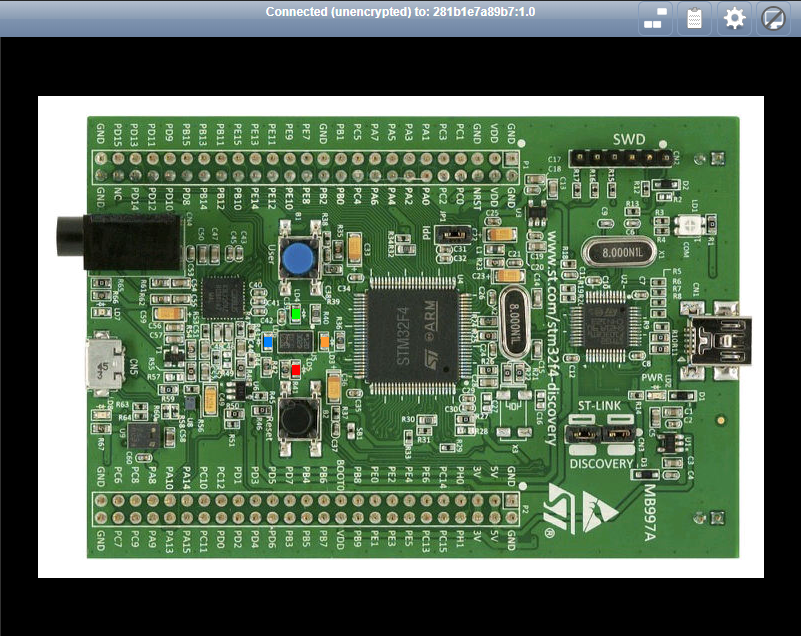

# Virtual Embedded Systems Lab

In this lab we will introduce you to some tasks that you will likely perform when you start working as an embedded systems engineer. We will cover the following in these labs:
1. GPIO Output
2. GPIO Input based on polling and interrupts
3. Emulating SPI using GPIO, for when a hardware SPI is not present in a device
4. Writing a device driver for a peripheral attached with SPI
5. Writing a state machine based orchestration system

## What to do in the labs
In each of the labs you will have functions marked with `@todo`, you need to implement those functions.

But before we jump in let's Setup our systems so that we can run the labs themselves.

## Setup
1. Install Docker and Docker-Compose
    
    **Windows/Mac**: [Docker Desktop for Windows/Mac](https://www.docker.com/products/docker-desktop)

    **Linux**: [Docker CE](https://docs.docker.com/install/linux/docker-ce/ubuntu/) and [Docker Compose](https://docs.docker.com/compose/install/)
2. Install [VSCode](https://code.visualstudio.com/download)
3. Install [Remote Containers extension for VSCode](https://marketplace.visualstudio.com/items?itemName=ms-vscode-remote.remote-containers)
4. Download the [lab materials](https://github.com/rijulg/virtual-embedded-systems-lab).
5. Open the folder using [VSCode containers](https://code.visualstudio.com/docs/remote/containers#_quick-start-try-a-dev-container)
    
    **Note:** When you open the lab the very first time a Docker Image and container will be built. This takes quite some time based on your internet speed and computer's performance metrics; but subsequent runs will be only using the image as well as the container so will be much faster.
6. Run Lab 1 Part 1 by running the lab run task
    
    1. Bring up the commands menu by pressing `Ctrl+Shift+P`
    2. Write `Tasks: Run Task`
    3. Run the `Run Lab` Task
    4. Select and run `Lab_1_Part_1`
    5. Open "No VNC" in your browser by going to http://127.0.0.1:6080/vnc.html
    6. Enter the password "*embedit*" to connect and view the output
